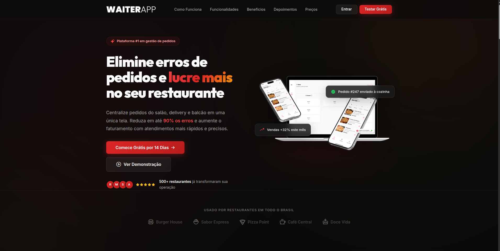
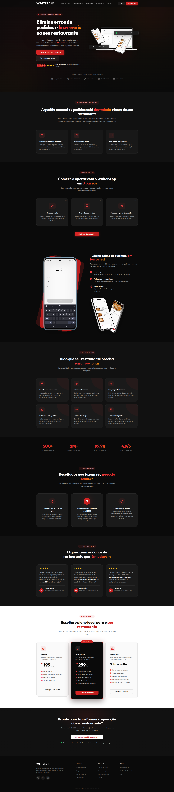

# WaiterApp - Landing Page de Gestão de Pedidos para Restaurantes



## 📋 Visão Geral

Esta landing page foi desenvolvida para apresentar o **WaiterApp**, uma solução completa de gestão de pedidos para restaurantes que busca eliminar erros, agilizar o atendimento e aumentar o faturamento através da digitalização completa do processo de pedidos.

A página foi projetada com foco em conversão, seguindo as melhores práticas de design UX/UI e estratégias de marketing digital para restaurantes que desejam modernizar sua operação.




## 🎯 Objetivo do Projeto

Criar uma landing page de alta conversão que:
- Apresente claramente o problema dos restaurantes (erros de pedidos, atendimento lento, falta de dados)
- Apresente o WaiterApp como solução completa
- Construa confiança através de provas sociais e depoimentos
- Apresente planos e preços de forma clara
- Leve o visitante à ação (teste gratuito ou demonstração)

## 🏗️ Estratégia de Arquitetura dos Arquivos

```
landingpage-waiter/
├── index.html          # Estrutura semântica e acessível
├── styles.css          # Estilos modernos com variáveis CSS e mobile-first
├── scripts.js          # Interatividade e funcionalidades dinâmicas
├── assets/             # Recursos otimizados
│   ├── Logo.png        # Logotipo da marca (SVG recomendado para próximas versões)
│   ├── Devices.png     # Ilustração hero mostrando o app em uso
│   ├── xiaomi-12-2022-medium.png  # Mockup de dispositivo para showcase
│   ├── capa.png        # Imagem principal para redes sociais
│   ├── demo.png        # Preview completo da landing page
│   ├── celulares.png   # Múltiplos dispositivos mostrando o app
│   ├── login.mov       # Vídeo demonstrativo otimizado para web
│   └── favicon.ico     # Ícone da aba do navegador
└── README.md           # Este documento
```

### Decisões Estratégicas de Arquitetura:
1. **Separação de preocupações**: HTML (estrutura), CSS (estilo), JS (comportamento)
2. **Assets organizados por tipo**: Todas as mídias na pasta assets para fácil manutenção
3. **Naming descritivo**: Arquivos nomeados de forma clara para facilitar identificação
4. **Otimização de assets**: Imagens compridas e vídeos em formato adequado para web

## 🚀 Estratégia de Otimização

### Performance:
- **Lazy Loading**: Imagens e vídeos carregados apenas quando entram no viewport
- **Preconnect**: Conexões antecipadas com Google Fonts para reduzir latência
- **CSS otimizado**: Uso de variáveis CSS para facilitar manutenção e temas futuros
- **JavaScript assíncrono**: Script carregado no final do body para não bloquear renderização
- **Formatos modernos**: Uso de PNG otimizado e considere WebP para próximas versões

### SEO & Acessibilidade:
- **HTML semântico**: Uso adequado de header, nav, section, footer
- **Meta tags**: Descrição relevante para mecanismos de busca
- **Alt text descritivo**: Todas as imagens possuem texto alternativo significativo
- **Contraste adequado**: Cores verificadas para acessibilidade WCAG
- **Navegação por teclado**: Suporte completo para navegação sem mouse
- **ARIA labels**: Elementos interativos com labels adequados para leitores de tela

### Responsividade:
- **Mobile-first approach**: Design pensado inicialmente para mobile
- **Breakpoints estratégicos**: Adaptado para mobile, tablet e desktop
- **Touch-friendly**: Elementos clicáveis com tamanho adequado para touch
- **Flexbox e CSS Grid**: Layouts flexíveis que se adaptam a diferentes telas

## 🎨 Estratégia de Design

### Identidade Visual:
- **Paleta de cores**: Profissional e confiável (azuis e tons de cinza com acentos vibrantes)
- **Tipografia**: 
  - Headings: Outfit (moderna, geométrica, boa legibilidade em títulos)
  - Body: Inter (excelente legibilidade em textos longos, ótima para UI)
- **Iconografia**: Phosphor Icons consistente em todo o site
- **Espaçamento**: Sistema de espaçamento consistente (8px grid)

### Psicologia das Cores e Conversão:
- **Azul predominante**: Transmite confiança, profissionalismo e tranquilidade
- **Verde em CTAs**: Associado à ação, crescimento e "prosseguir"
- **Gradients sutis**: Adicionam modernidade sem distrair da mensagem principal
- **Branco amplo**: Melhora legibilidade e foca atenção no conteúdo

### Hierarquia Visual:
1. **Hero section** com proposta de valor clara em poucos segundos
2. **Problema** que ressoa com o público-alvo
3. **Solução** apresentando o produto como resposta
4. **Prova social** para construir confiança
5. **Benefícios tangíveis** com números e resultados
6. **Depoimentos reais** de clientes satisfeitos
7. **Planos claros** com opção destacada (Profissional)
8. **CTA final** de baixa fricção (teste gratuito)

## 📈 Estratégia de Marketing

### Posicionamento:
- **Para quem**: Donos e gestores de restaurantes que enfrentam problemas com pedidos manuais
- **Dor**: Erros custosos, atendimento lento, perda de receita e clientes insatisfeitos
- **Solução**: WaiterApp - plataforma intuitiva que centraliza todos os pedidos em tempo real
- **Diferencial**: Interface tão simples que qualquer funcionário aprende em 5 minutos

### Funil de Conversão Implementado:
1. **Conscientização**: Hero com headline impactante e problema relatável
2. **Interesse**: Seção "Como Funciona" em 3 passos simples
3. **Desejo**: Benefícios quantificados (3h economizadas/dia, 30% aumento faturamento)
4. **Prova**: Depoimentos de clientes reais com nomes e estabelecimentos
5. **Confiança**: Métricas impressivas (500+ restaurantes, 99.9% uptime)
6. **Ação**: Múltiplos CTAs estratégicos ao longo da página
7. **Retensão**: Garantia de teste gratuito sem cartão de crédito

### Elementos de Persuasão Utilizados:
- **Prova Social**: Logos de clientes, depoimentos, métricas de uso
- **Autoridade**: Posicionamento como "Plataforma #1 em gestão de pedidos"
- **Escassez**: Oferta limitada de teste gratuito de 14 dias
- **Reciprocidade**: Valor oferecido antes de pedir algo (demo, informações)
- **Consistência**: Passos simples que levam naturalmente à ação
- **Liking**: Design agradável e linguagem próxima do público-alvo

### Otimização para Conversão:
- **CTAs acima da dobra**: Botão principal visível imediatamente
- **Múltiplos pontos de conversão**: CTAs em estratégicas posições da página
- **Formulário simplificado**: Promessa de setup rápido e sem burocracia
- **Redução de risco**: Garantia de cancelamento a qualquer momento
- **Prova de credibilidade**: Números específicos e depoimentos verificáveis

## 🛠️ Tecnologias Utilizadas

- **HTML5**: Estrutura semântica e acessível
- **CSS3**: 
  - Variáveis CSS para fácil manutenção de temas
  - Flexbox e Grid Layout
  - Animações e transições suaves
  - Media queries para responsividade
- **JavaScript ES6+**: 
  - Manipulação do DOM
  - Controle do menu mobile
  - Funcionalidades interativas
- **Google Fonts**: 
  - Outfit (para headings)
  - Inter (para body text)
- **Phosphor Icons**: Ícones vetoriais consistentes e leves
- **Font Display Swap**: Performance otimizada para carregamento de fontes

## 📱 Responsividade Testada

- **Mobile**: 320px - 480px (smartphones)
- **Tablet**: 481px - 768px (tablets pequenos e grandes)
- **Desktop**: 769px+ (laptops e monitores desktop)
- **Large Desktop**: 1200px+ (monitores grandes e 4K)

## 🔧 Como Executar Localmente

1. Clone este repositório:
   ```bash
   git clone https://github.com/seu-usuario/landingpage-waiter.git
   ```

2. Navegue até o diretório do projeto:
   ```bash
   cd landingpage-waiter
   ```

3. Abra o arquivo `index.html` no seu navegador preferido:
   - Duplo clique no arquivo, ou
   - Use uma extensão como "Live Server" no VS Code para recarregamento automático

## 📊 Métricas e Resultados Esperados

Com base nos depoimentos e alegações da página:
- **Redução de erros**: Até 90% menos erros de pedidos
- **Economia de tempo**: Até 3 horas por dia gastas em tarefas manuais
- **Aumento de faturamento**: Até 30% crescimento mensal
- **Velocidade de atendimento**: Dobro da velocidade após implementação
- **Satisfação do cliente**: Nota 4.9/5 em avaliações

## 🚀 Próximos Passos e Melhorias Futuras

### Técnicas:
- [ ] Implementar SVG para logotipo e ícones simples
- [ ] Adicionar schema.org markup para rich snippets no Google
- [ ] Implementar lazy loading mais avançado com Intersection Observer
- [ ] Otimizar critical CSS para melhorar First Contentful Paint
- [ ] Implementar service worker para offline básico e PWA

### Conteúdo:
- [ ] Aumentar variedade de depoimentos com diferentes tipos de restaurantes
- [ ] Adicionar estudos de caso detalhados com números específicos
- [ ] Criar seção de integrações com outros sistemas (POS, contabilidade, etc.)
- [ ] Adicionar blog ou seção de recursos para educar o público-alvo
- [ ] Implementar A/B testing para otimizar CTAs e mensagens

### Marketing:
- [ ] Implementar pixel do Facebook e Google Analytics para remarketing
- [ ] Criar landing pages específicas para diferentes segmentos (delivery, fine dining, etc.)
- [ ] Desenvolver sequência de email nurturing para leads do teste gratuito
- [ ] Criar conteúdo para redes sociais que direcione para a landing page
- [ ] Implementar programa de indicação para clientes existentes

## 📄 Licença

Este projeto está sob a licença MIT - veja o arquivo [LICENSE](LICENSE) para mais detalhes.

## 👥 Autor

**Gerson Santos Silva**  
Desenvolvedor Frontend & UX/UI Designer  
[LinkedIn](https://www.linkedin.com/in/gerson-santos-silva/)

## 🙏 Agradecimentos

- Phosphor Icons pelo excelente conjunto de ícones gratuitos
- Google Fonts pelas fontes Outfit e Inter
- Vercel pela hospedagem confiável para demonstração

---

✨ **WaiterApp - Transforme a gestão de pedidos do seu restaurante hoje mesmo!** ✨
[Ver projeto ao vivo](https://landingpage-waiter.vercel.app/)