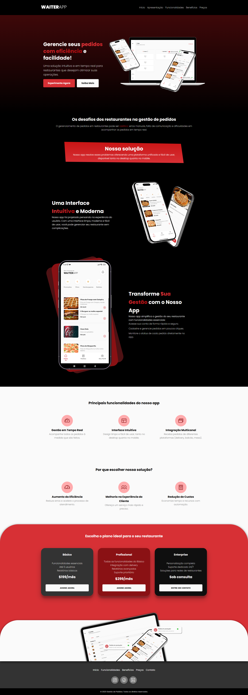

# Landing Page - Gestão de Pedidos

## Projeto completo

📌 Sobre o Projeto

Esta landing page foi criada para promover um app de Gestão de Pedidos , uma solução intuitiva e eficiente para restaurantes gerenciarem seus pedidos em tempo real. A página foi projetada para ser visualmente atraente, responsiva e fácil de navegar, garantindo uma excelente experiência para os visitantes

🔑 Funcionalidades Principais
- Seção Hero: Apresenta o produto com um título impactante, descrição e botões de ação.
- Demonstração de Funcionalidades: Destaca recursos como login seguro, realização de pedidos e acompanhamento em tempo real.
- Interface Moderna: Explica o design intuitivo e responsivo do app.
- Vídeo Demonstrativo: Inclui um vídeo para mostrar o app em ação.
- Planos e Preços: Apresenta opções de assinatura para diferentes tipos de restaurantes.

🛠 Tecnologias Utilizada:
- HTML5: Estrutura básica da página.
- CSS3: Estilização moderna e responsiva.
- Google Fonts: Fonte "General Sans" para um design limpo e profissional.

📜 Licença
Este projeto está sob a licença MIT . Veja o arquivo LICENSE para mais detalhes.

📧 Contato
Se tiver dúvidas ou sugestões, entre em contato:

- LinkedIn : [linkedin.com/in/seu-perfil](https://www.linkedin.com/in/gerson-santos-silva/)